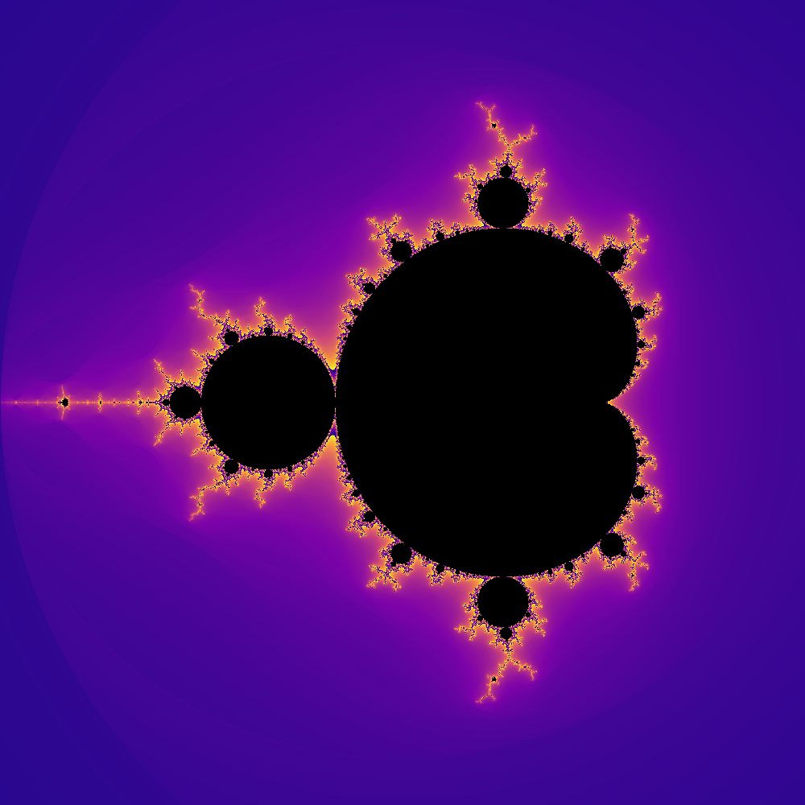
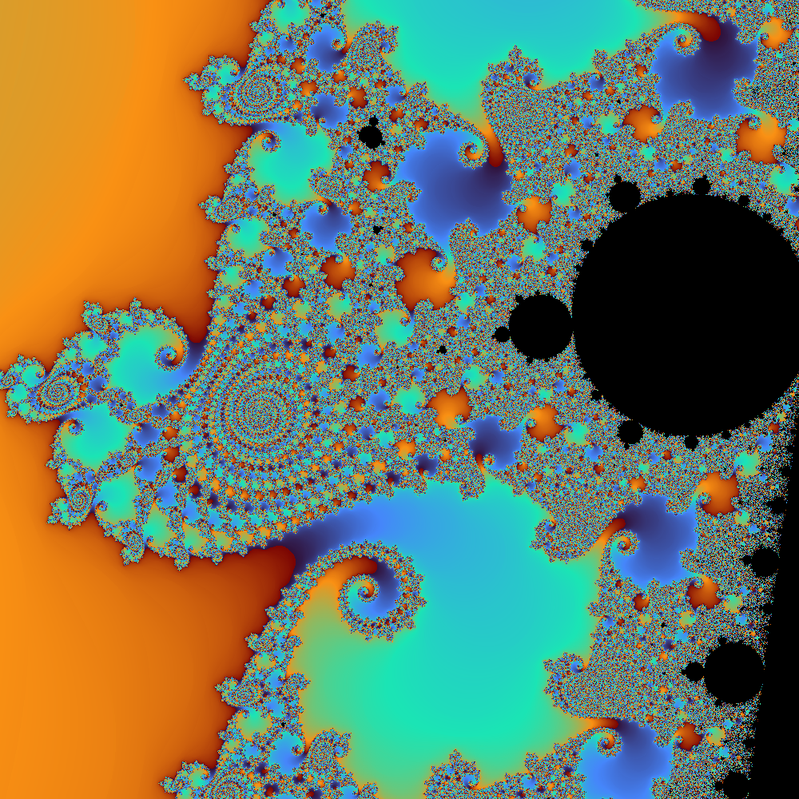
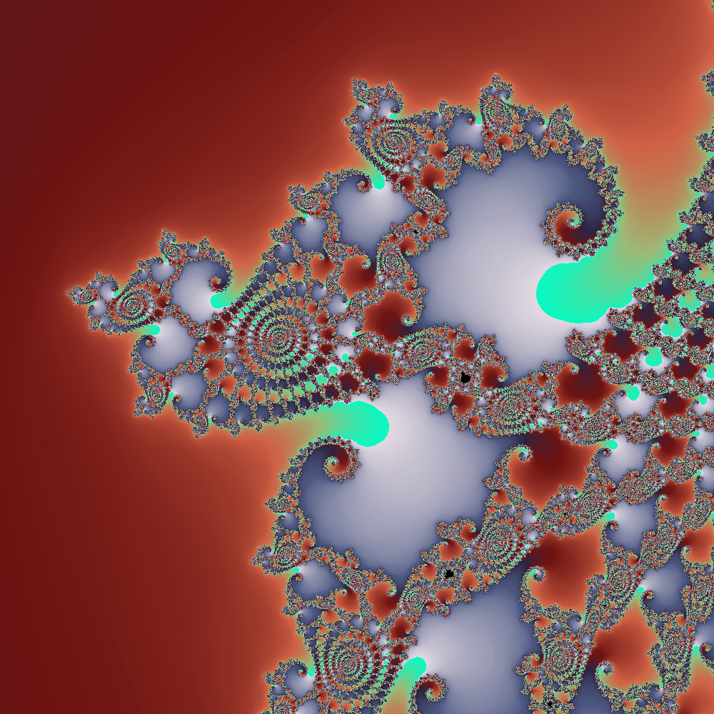

# Mandelbrot Explorer (Rust)

  
  
  
  

Explorador interactivo del **conjunto de Mandelbrot** escrito en Rust. Renderiza el fractal en tiempo real, 
permite hacer zoom interactivo, cambiar paletas de color, ajustar el número de iteraciones y guardar capturas en PNG.

---

## Características

- **Render paralelo** con [Rayon](https://crates.io/crates/rayon): usa todos los núcleos
  de tu CPU automáticamente.
- **Coloración suavizada** (*smooth coloring*) para evitar las bandas visibles típicas
  del fractal.
- **8 paletas de color** ciclables, inspiradas en las de Matplotlib:
  `Grayscale`, `Viridis`, `Inferno`, `Plasma`, `Turbo`, `Hot`, `Flag`, `Twilight`.
- **Zoom interactivo** con un simple toque de ratón.
- **Deshacer zoom** con historial en buffer.
- **Ajuste de iteraciones** en pasos de 1000 en tiempo real.
- **Exportación a PNG** de la vista actual a la carpeta `Capturas/`.
- **Leyenda en pantalla** con coordenadas del centro, nivel de zoom, iteraciones,
  paleta activa, tiempo de render y controles.

## Requisitos

### Sistema operativo

| SO | Estado | Notas |
|---|---|---|
| Linux + X11 | ✅ Soportado | Backend X11 nativo |
| Linux + Wayland | ✅ Soportado | A través de Xwayland (backend X11) |
| Windows 10/11 | ✅ Soportado | Backend Win32 (por defecto de `minifb`) |
| macOS 11+ | ✅ Soportado | Backend Cocoa (por defecto de `minifb`) |

No funciona en Wayland puro sin Xwayland activado.

### Hardware

| Componente | Mínimo | Recomendado |
|---|---|---|
| CPU | x86_64 o ARM64, 1 núcleo | 4+ núcleos (Rayon reparte el trabajo) |
| RAM | 2 GB (1 GB libre durante la compilación) | 4 GB |
| Disco | 500 MB libres para `target/` | 1 GB |
| GPU | No necesaria (render 100 % CPU) | — |
| Pantalla | 1024×768 | 1920×1080 o superior |

Con 1 solo núcleo el programa funciona, pero cada render puede tardar varios
segundos. A partir de 4 núcleos la interacción es fluida.

### Software

- **Rust** 1.75 o superior, instalable vía [rustup](https://rustup.rs/).
- **Enlazador del sistema**:
  - Linux (Debian/Ubuntu): `sudo apt install build-essential`
  - Linux (Fedora): `sudo dnf groupinstall "Development Tools"`
  - Linux (Arch): `sudo pacman -S base-devel`
  - Windows: [Visual Studio Build Tools](https://visualstudio.microsoft.com/visual-cpp-build-tools/)
    con la carga de trabajo "Desarrollo para el escritorio con C++".
  - macOS: Xcode Command Line Tools (`xcode-select --install`).
- **Bibliotecas de desarrollo X11** (solo Linux):
  - Debian/Ubuntu: `sudo apt install libx11-dev libxkbcommon-dev libxcb1-dev`
  - Fedora: `sudo dnf install libX11-devel libxkbcommon-devel libxcb-devel`
  - Arch: `sudo pacman -S libx11 libxkbcommon libxcb`

En la mayoría de escritorios Linux estas bibliotecas ya vienen instaladas; solo
hacen falta explícitamente en instalaciones mínimas o contenedores.

En Windows y macOS no se requiere ninguna dependencia adicional: `minifb` usa
las APIs del sistema (Win32 y Cocoa respectivamente).

## Instalación

bash

>git clone https://github.com/fserradilla65-afk/mandelbrot-rust.git   
>cd mandelbrot-rust  
>cargo build --release  ### La primera compilación tarda un poco (sobre todo por la dependencia image), pero las siguientes son casi instantáneas.

## Uso

bash

>cargo run --release  ### Usa siempre --release: en modo debug el render puede ser 20–50 veces más lento.
>cargo run --release -- cX cY Zoom  ### Se indican las coordenadas X e Y en el centro de la imagen y el aumento -zoom- (si no se indica, es 1)

## Controles

- Hacer zoom: click izquierdo sobre un punto. Hace un zoom de 2x tomando como centro de la siguiente imágen.
- Deshacer zoom: click derecho / U. Vuelve a la imágen anterior.
- Aumentar iteraciones (+1000): I
- Reducir iteraciones (−1000): O
- Cambiar paleta: P (rota por las 8 paletas)
- Guardar captura PNG: S
- Resetear al conjunto principal: R
- Salir: Esc
- Paletas: El ciclo con 'P' recorre, en este orden:
 → Viridis → Inferno → Plasma → Turbo → Hot → Flag → Twilight → Grayscale
 Viridis, Inferno, Plasma, Turbo: perceptualmente uniformes, seguras para daltonismo (familia Matplotlib). 
 Hot: la clásica de MATLAB.
 Flag: 8 colores puros cíclicos, ideal para ver los bucles de iteración.
 Twilight: paleta cíclica, con extremos claros y centro oscuro.
 Grayscale: escala de grises pura.
- Capturas: Al pulsar 'S' se guarda la imagen actual (sin leyenda ni barra de paleta) como PNG en: ~Imágenes/Capturas/mandelbrot_<timestamp>.png. El nombre incluye el timestamp en segundos desde epoch, así que las capturas nunca se sobrescriben. Si se pulsa 'Shift+S', guarda la imagen con leyenda y barra de paleta.

## Estructura del proyecto

mandelbrot-rust/
├── Cargo.toml
├── src/
│   └── main.rs        # Todo el programa (viewport, paletas, render, UI, capturas)
├── Capturas/          # Generada al pulsar S (no versionada)
└── README.md
El programa es un único archivo main.rs, organizado en secciones:

Paletas de color — enum Palette + datos de anclas RGB.

Viewport — región del plano complejo a renderizar.

Render — cálculo del fractal con Rayon y smooth coloring.

Zoom — transformación de coordenadas pantalla → plano complejo.

Selección y leyenda — rectángulo invertido, texto con font8x8, formato de tiempo.

main — bucle de eventos, manejo de ratón y teclado, composición del frame.

## Rendimiento

Referencias aproximadas en un CPU moderno de 8 núcleos, buffer de 1000 × 1000:

Iteraciones	Tiempo por render
1.000	~80–150 ms
5.000	~300–600 ms
10.000	~0,6–1,2 s
50.000	~3–6 s
El uso de Rayon reparte el coste entre todos los núcleos disponibles.

## Limitaciones conocidas

- **Wayland nativo no soportado en Linux.** La app fuerza el backend X11 de
  `minifb`, que funciona perfectamente a través de Xwayland. Como consecuencia,
  no arranca en compositores Wayland sin Xwayland activado (poco habitual en
  escritorios de usuario).
- **Aviso inofensivo al cerrar (Linux/Wayland).** Al salir pueden aparecer
  mensajes `queue 0x... destroyed while proxies still attached` en la terminal.
  Son emitidos por la capa de Wayland/Xwayland al liberar recursos y no indican
  ningún error real.
- **Precisión limitada a `f64`.** Permite zooms hasta un factor de ~10¹³–10¹⁵
  según la zona explorada. Más allá aparecen imagenes cada vez más pixeladas.
- **Sin posicionamiento programático de la ventana.** `minifb` no expone API
  multiplataforma para esto. Si la ventana aparece mal colocada, muévela
  manualmente con el gestor de ventanas.

## Reconocimientos

Las paletas Viridis, Inferno, Plasma y Turbo provienen del proyecto Matplotlib,
a su vez basadas en trabajo de Nathaniel Smith, Stéfan van der Walt, Bastian
Bechtold, y otros.

Hot, Flag y Jet son herencia de MATLAB / IDL.

## Licencia

Este proyecto se distribuye bajo la licencia **MIT**. Consulta el archivo
[LICENSE](LICENSE) para el texto completo.

En resumen: puedes usar, copiar, modificar, fusionar, publicar, distribuir,
sublicenciar y vender copias del software, siempre que preserves el aviso de
copyright original y no se responsabilice al autor de posibles daños.
