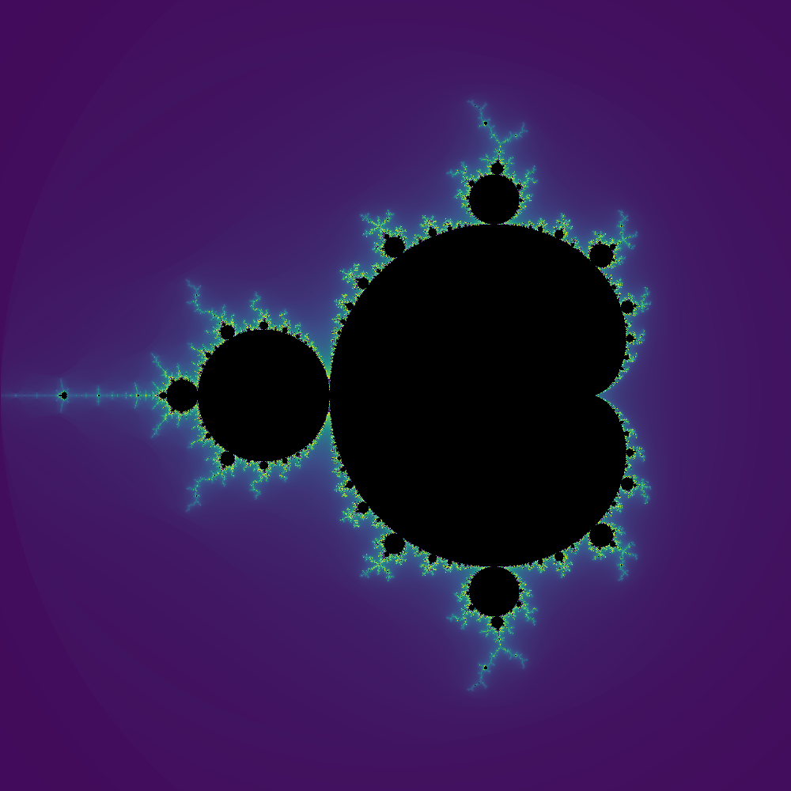

# Mandelbrot Explorer (Rust)

Explorador interactivo del **conjunto de Mandelbrot** escrito en Rust...
Explorador interactivo del **conjunto de Mandelbrot** escrito en Rust. Renderiza el
fractal en tiempo real sobre la CPU usando paralelismo con Rayon, permite hacer zoom
interactivo, cambiar paletas de color, ajustar el número de iteraciones y guardar
capturas en PNG.

---

## Características

- **Render paralelo** con [Rayon](https://crates.io/crates/rayon): usa todos los núcleos
  de tu CPU automáticamente.
- **Coloración suavizada** (*smooth coloring*) para evitar las bandas visibles típicas
  del fractal.
- **8 paletas de color** ciclables, inspiradas en las de Matplotlib:
  `Grayscale`, `Viridis`, `Inferno`, `Plasma`, `Turbo`, `Hot`, `Flag`, `Twilight`.
- **Zoom interactivo** por arrastre con el ratón, con rectángulo de selección siempre
  visible (dibujado por inversión de bits).
- **Deshacer zoom** con pila de historial.
- **Ajuste de iteraciones** en pasos de 1000 en tiempo real.
- **Exportación a PNG** de la vista actual a la carpeta `Capturas/`.
- **Leyenda en pantalla** con coordenadas del centro, nivel de zoom, iteraciones,
  paleta activa, tiempo de render y controles.

---

## Requisitos

- **Rust** 1.75 o superior (instalable vía [rustup](https://rustup.rs/)).
- En Linux, las dependencias de sistema que requiere `minifb` (habitualmente ya
  presentes): `libxkbcommon`, `libwayland` o `libX11`.
- Una GPU con drivers actualizados **no** es necesaria — todo el render es por CPU.

## Instalación

bash

>git clone <url-del-repo> mandelbrot-rust
>cd mandelbrot-rust
>cargo build --release ## La primera compilación tarda un poco (sobre todo por la dependencia image), pero las siguientes son casi instantáneas.

## Uso

bash

>cargo run --release   ## Usa siempre --release: en modo debug el render puede ser 20–50 veces más lento.
>cargo run --release -- cX cY Zoom   ## Se indican las coordenadas X e Y en el centro de la imagen y el aumento -zoom- (si no se indica, es 1)

## Controles

- Hacer zoom: click izquierdo sobre un punto. Hace un zoom de 2x tomando como centro de la siguiente imágen.
- Deshacer zoom: click derecho / U. Vuelve a la imágen anterior.
- Aumentar iteraciones (+1000): I
- Reducir iteraciones (−1000): O
- Cambiar paleta: P (rota por las 8 paletas)
- Guardar captura PNG: S
- Resetear al conjunto principal: R
- Salir: Esc
- Paletas: El ciclo con 'P' recorre, en este orden:
 → Viridis → Inferno → Plasma → Turbo → Hot → Flag → Twilight → Grayscale
 Viridis, Inferno, Plasma, Turbo: perceptualmente uniformes, seguras para daltonismo (familia Matplotlib). 
 Hot: la clásica de MATLAB.
 Flag: 8 colores puros cíclicos, ideal para ver los bucles de iteración.
 Twilight: paleta cíclica, con extremos claros y centro oscuro.
 Grayscale: escala de grises pura.
- Capturas: Al pulsar 'S' se guarda la imagen actual (sin leyenda ni barra de paleta) como PNG en: ~Imágenes/Capturas/mandelbrot_<timestamp>.png. El nombre incluye el timestamp en segundos desde epoch, así que las capturas nunca se sobrescriben. Si se pulsa 'Shift+S', guarda la imagen con leyenda y barra de paleta.

## Estructura del proyecto:

mandelbrot-rust/
├── Cargo.toml
├── src/
│   └── main.rs        # Todo el programa (viewport, paletas, render, UI, capturas)
├── Capturas/          # Generada al pulsar S (no versionada)
└── README.md
El programa es un único archivo main.rs, organizado en secciones:

Paletas de color — enum Palette + datos de anclas RGB.

Viewport — región del plano complejo a renderizar.

Render — cálculo del fractal con Rayon y smooth coloring.

Zoom — transformación de coordenadas pantalla → plano complejo.

Selección y leyenda — rectángulo invertido, texto con font8x8, formato de tiempo.

main — bucle de eventos, manejo de ratón y teclado, composición del frame.

## Rendimiento

Referencias aproximadas en un CPU moderno de 8 núcleos, buffer de 1000 × 1000:

Iteraciones	Tiempo por render
1.000	~80–150 ms
5.000	~300–600 ms
10.000	~0,6–1,2 s
50.000	~3–6 s
El uso de Rayon reparte el coste entre todos los núcleos disponibles.

## Limitaciones conocidas:

En `Wayland`, los mensajes de advertencia
queue 0x... destroyed while proxies still attached al cerrar la ventana son
inofensivos; provienen de la limpieza de recursos de minifb.

En `Wayland`, algunas teclas con Shift o CapsLock activos pueden no detectarse
debido a cómo minifb mapea los keysyms. Si ocurre, prueba a soltar los
modificadores.

La ventana no puede posicionarse programáticamente con minifb (no expone
API multiplataforma). Si aparece escondida, muévela con tu gestor de ventanas
o activa topmost: true en WindowOptions.

La precisión es f64, lo que permite zooms profundos pero no infinitos. A
partir de un factor ~10¹³ se empiezan a ver imágenes cada vez más pixeladas 
por la aritmética de punto flotante.

`minifb` incluye un backend nativo de Wayland que está incompleto: las ventanas
no se pueden mover, no muestran decoraciones y `set_position` se ignora. Para
evitarlo, el proyecto usa solo el backend X11 (que funciona perfectamente bajo
Xwayland). No requiere ninguna configuración por parte del usuario: está
forzado en `Cargo.toml`.

## Dependencias principales:

Crate	Uso
minifb	Ventana y framebuffer de píxeles
num-complex	Aritmética de números complejos
rayon	Paralelización del bucle de render
font8x8	Fuente bitmap para dibujar la leyenda
image	Exportación a PNG
Licencia
MIT — haz con el código lo que quieras.

## Reconocimientos:

Las paletas Viridis, Inferno, Plasma y Turbo provienen del proyecto Matplotlib,
a su vez basadas en trabajo de Nathaniel Smith, Stéfan van der Walt, Bastian
Bechtold, y otros.

Hot, Flag y Jet son herencia de MATLAB / IDL.
